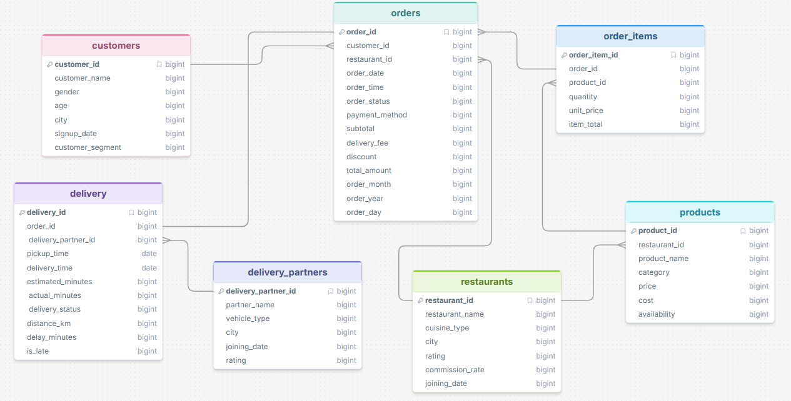
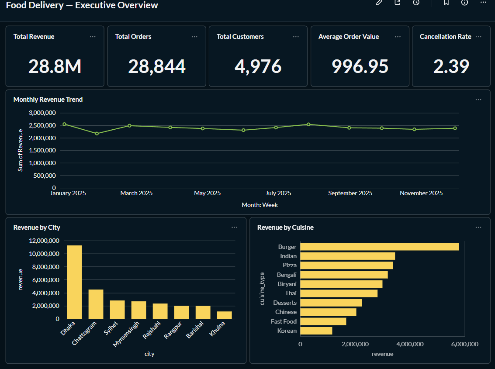
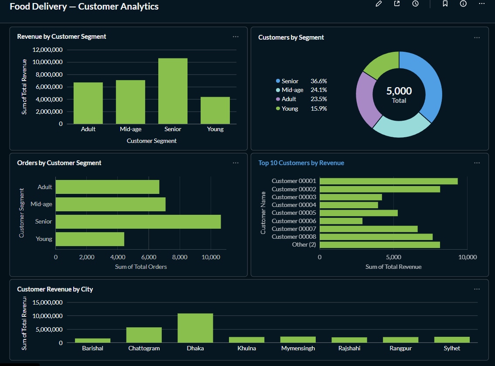
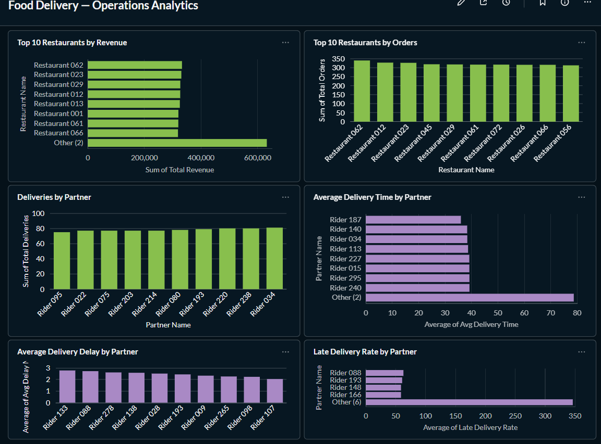
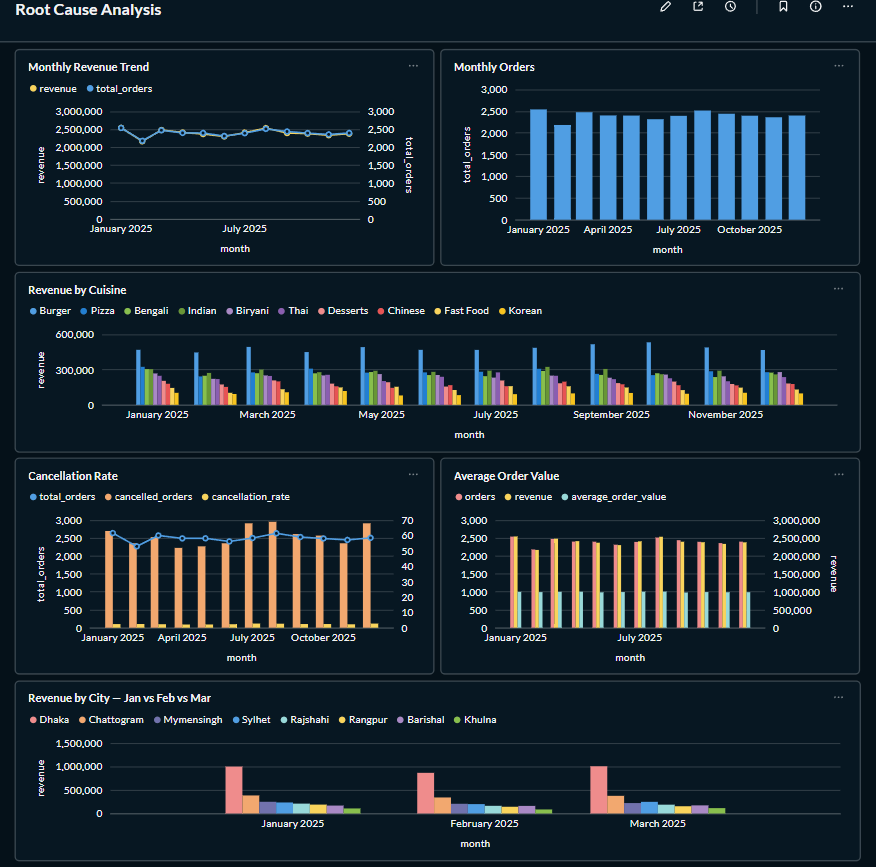

# 🍔 Food Delivery Business Analysis

> An end-to-end data analytics project analyzing food delivery transactions, customer behavior, restaurant performance, product sales, and delivery operations using **Python, SQL, Supabase PostgreSQL, and Metabase**.

## 💡 Key Business Insights

The analysis helps answer important business questions such as:

1. Which cities generate the highest revenue?  
2. Which restaurants receive the most orders?  
3. Which cuisines contribute the most revenue?  
4. Who are the highest-value customers?  
5. Which customer segments generate the most revenue?  
6. How does revenue change month over month?  
7. What percentage of orders are cancelled?  
8. Which restaurants have the highest average order value?  
9. Which cities have the strongest restaurant performance?  
10. Why did revenue decline in February compared to January?  
11. Was the decline caused by fewer orders or lower customer spending?  
12. Did the cancellation rate increase in February?  
13. Which cities contributed most to the revenue decline?  
14. Which cuisines experienced the largest revenue drop?  
15. Which restaurants were most affected?  
16. What factors contributed to the revenue recovery in March?


---

## 📌 Project Overview

This project demonstrates a complete **data analytics workflow**, starting from raw food delivery transaction data and transforming it into meaningful business insights.

The project covers:

* 🧹 Data cleaning and validation using Python
* 🔄 Data transformation using Pandas
* 🗄️ Relational database management using Supabase PostgreSQL
* 🔍 Business and transactional analysis using SQL
* 📊 Analytical SQL views for reporting
* 📈 Interactive dashboard development using Metabase
* 🎯 KPI development and performance analysis
* 💡 Business insight generation

---

## 🔄 Project Workflow

```text
Raw Data
    ↓
Python Data Cleaning
    ↓
Supabase PostgreSQL
    ↓
SQL Analysis
    ↓
SQL Views
    ↓
Metabase
    ↓
Interactive Dashboard
    ↓
Business Insights
```

---

## 🛠️ Technologies Used

| Technology     | Purpose                                      |
| -------------- | -------------------------------------------- |
| **Python**     | Data cleaning and preprocessing              |
| **Pandas**     | Data manipulation and transformation         |
| **NumPy**      | Numerical analysis                           |
| **SQL**        | Business and transactional analysis          |
| **Supabase**   | PostgreSQL database and cloud data storage   |
| **PostgreSQL** | Relational database management               |
| **Metabase**   | Data visualization and dashboard development |
| **GitHub**     | Version control and project documentation    |

---

## 🗂️ Data Model

The project uses a **relational data model in Supabase PostgreSQL** to organize food delivery transactions and related business entities.

The data model is designed to maintain data consistency, reduce redundancy, and support efficient SQL-based business analysis.

### 📊 Data Model Preview




# 📊 Metabase Dashboard

The cleaned and structured data was connected to **Metabase** to build an interactive business intelligence dashboard focused on revenue, customers, restaurants, products, and delivery performance.

---

## 01. 📈 Executive Overview

Provides a high-level overview of the overall food delivery business performance.

### Key Performance Indicators

* **Total Revenue**
* **Total Orders**
* **Total Customers**
* **Average Order Value**
* **Cancellation Rate**

### Visualizations

* Monthly Revenue Trend
* Monthly Order Trend
* Revenue by City
* Revenue by Cuisine
* Order Status Distribution

### Dashboard Preview



---

## 02. 👥 Customer Analytics

Focuses on customer activity, spending behavior, purchasing patterns, and customer segmentation.

### Key Performance Indicators

* **Total Customers**
* **Total Orders**
* **Average Customer Spending**
* **Customer Revenue**

### Visualizations

* Top Customers by Revenue
* Top Customers by Orders
* Revenue by Customer Segment
* Customer Distribution by City
* Customer Spending Analysis

### Dashboard Preview



---

## 03. 🚚 Delivery & Operations Analytics

Focuses on delivery performance, operational efficiency, order fulfillment, and delivery-related business metrics.

### Key Performance Indicators

* **Total Deliveries**
* **Average Delivery Time**
* **On-Time Delivery Rate**
* **Cancelled Orders**
* **Delivery Success Rate**

### Visualizations

* Delivery Performance by City
* Average Delivery Time Trend
* Order Status Analysis
* Delivery Performance by Restaurant
* Delivery Time Distribution
* On-Time vs Late Deliveries

### Dashboard Preview



---

## 04. 🔎 Revenue Root Cause Analysis

This section investigates **why revenue decreased in February compared to January and how the business recovered in March**.

### 🔍 Key Factors Analyzed

- **Order Volume** — Identifying whether the number of completed orders decreased or increased.
- **Average Order Value (AOV)** — Measuring changes in average customer spending per order.
- **Cancellation Rate** — Analyzing whether increased cancellations affected completed orders and revenue.
- **City-wise Performance** — Identifying cities that contributed most to the revenue decline or recovery.
- **Cuisine-wise Performance** — Identifying cuisines with significant changes in revenue and order volume.
- **Restaurant Performance** — Identifying restaurants responsible for major revenue changes.

### Dashboard Preview


## 🎯 Business Objectives

The primary objectives of this project are to:

1. Analyze overall food delivery business performance.
2. Identify revenue and order trends over time.
3. Understand customer purchasing behavior.
4. Identify high-value and high-frequency customers.
5. Evaluate restaurant performance.
6. Compare restaurant and cuisine performance across cities.
7. Analyze order cancellations and operational performance.
8. Generate actionable business insights using data.


---


## 🚀 Project Outcome

This project demonstrates an end-to-end **data analytics pipeline** from raw data to business intelligence reporting.

It combines **Python for data preparation, PostgreSQL/Supabase for data storage, SQL for business analysis, and Metabase for interactive visualization**, resulting in a practical analytics solution for a food delivery business.

---

## 👩‍💻 Skills Demonstrated

**Data Analytics | Python | Pandas | NumPy | SQL | PostgreSQL | Supabase | Metabase | Data Cleaning | Data Transformation | KPI Analysis | Business Intelligence | Data Visualization**
